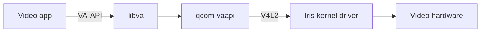

# qcom-vaapi

Hardware video decoding for **Snapdragon X Elite (X1E80100)** on Linux.
This Rust VA-API driver connects apps to Qualcomm's Iris decoder through V4L2.
Other Qualcomm chips are untested.

## Current state — 0.1.1-rc.6

**Experimental ARM64 release.** RC6 fixes internal handle growth when browsers
export a decoded surface repeatedly. The required decode/export matrix and
session churn passed on the tested Dell XPS 13 9345. Sustained Firefox and Chrome
playback on this build remains unqualified. RC5 previously played 4K AV1 in
Chrome; those historical results do not qualify the new binary.

| Codec | Support |
| --- | --- |
| H.264 | Baseline, Main, High |
| HEVC | Main, Main10 |
| VP9 | Profile 0 |
| AV1 | Experimental Profile 0, 8-bit, no film grain |

CPU image access and DRM PRIME export are supported. Exported surfaces retain
their own backing storage; this does not establish an end-to-end zero-copy path.
Firefox, 10-bit AV1, other chips and broad suspend/resume reliability remain
unqualified.

## Install

Download the `.deb` from [the rc.6 release](https://github.com/quanlou/qcom-vaapi/releases/tag/v0.1.1-rc.6), then:

```sh
sudo apt install ./qcom-vaapi_0.1.1.rc.6_arm64.deb
```

**Requirements:** ARM64, X1E80100, `libc6 >= 2.44`, `libva2 >= 2.24`, and a
compatible Iris kernel driver. This binary was built on Ubuntu 26.10 development
with patched `7.3.0-15-qcom-x1e` modules. Older Ubuntu releases cannot install
it unchanged. The package contains user-space libraries only; it does not
install the required kernel fixes or firmware.

See [release details](docs/releases/0.1.1-rc.6.md) for the tested kernel,
limitations, checksums and source archives. The included `.deb` is an early
hardware-specific build, not a general Qualcomm driver package.

Restart video apps after installing, then check:

```sh
vainfo
```

The vendor label should say `qcom-vaapi 0.1.1-rc.6`, with
`VAProfileAV1Profile0 : VAEntrypointVLD` listed. To remove:

```sh
sudo apt remove qcom-vaapi
```

## How it works



libva loads `msm_drv_video.so` because the platform's DRM driver is named `msm`.
The driver discovers the Iris decoder node automatically. FFmpeg's direct
`h264_v4l2m2m` decoder is a separate path used as a frame reference.

## Build from source

A recent Rust toolchain is required. Build an isolated driver:

```sh
./tools/build-rust-driver.sh /tmp/qcom-vaapi
LIBVA_DRIVERS_PATH=/tmp/qcom-vaapi vainfo --display drm --device /dev/dri/renderD128
```

The default build advertises H.264, HEVC and VP9. Build the AV1 installation
variant with:

```sh
V4L2_VA_BUILD_FEATURES=system-av1 ./tools/build-rust-driver.sh /tmp/qcom-vaapi-av1
```

AV1 also needs `libiris_av1_complete.so`. Its corresponding FFmpeg source and
build inputs are release assets; see [the companion build instructions](docs/releases/0.1.1-rc.5.md#build-the-av1-companion).
Create a system package from the two built libraries:

```sh
python3 tools/package-deb.py \
  --driver /tmp/qcom-vaapi-av1/msm_drv_video.so \
  --companion /path/to/libiris_av1_complete.so \
  --ffmpeg-source /path/to/ffmpeg-source \
  --output /tmp/qcom-vaapi-package
```

The helper detects library dependencies and includes license notices. Build on
the oldest distribution you intend to support; rebuilding on another host still
requires hardware qualification there.

## Validation

The exact RC6 driver passed:

- 270 host tests (4 ignored); formatting and strict lint checks.
- H.264 frame parity at 1, 30 and 300 frames; HEVC, Main10 and VP9 parity.
- GL/export checks, resolution changes, long playback and all 7 session churn cases.
- NV12/P010 regressions covering 1,024 surface reuse/export cycles and client
  descriptor lifetime after surface destruction.

Sustained Firefox/Chrome playback and a new exact 4K AV1 replay have not passed
on RC6. Installation authentication did not complete, and the replay preflight
found the decoder busy. [Release details](docs/releases/0.1.1-rc.6.md) record the
precise scope and hashes. Historical [RC5 results](docs/releases/0.1.1-rc.5.md)
remain available separately.

For local verification, close video apps first and supply the documented fixtures:

```sh
./tools/verify-rust-driver.sh /tmp/qcom-vaapi
./tools/verify-session-churn.sh /tmp/qcom-vaapi
```

The full deployment gate is `tools/verify-production.sh`. Hardware checks are
specific to their kernel, driver, browser and fixtures; missing checks do not
count as passes. GitHub Actions runs the hardware-free checks.

## Useful settings

| Variable | Purpose |
| --- | --- |
| `V4L2_VA_DEBUG=1` | Driver logs |
| `V4L2_VA_DEVICE=/dev/video0` | Override decoder discovery |
| `V4L2_VA_EXPERIMENTAL_AV1=0` | Disable AV1 in the system variant |
| `V4L2_VA_AV1_COMPLETE_LIBRARY=/path/to/library.so` | Override the AV1 companion |
| `V4L2_VA_STRICT=1` | Fail verification on missing or skipped checks |
| `V4L2_VA_SAMPLE=/path/to/video.mp4` | Verification input |

For AV1 in a default source build, set both `V4L2_VA_EXPERIMENTAL_AV1=1` and
`V4L2_VA_AV1_CBS_TRANSPORT=1`, and provide the companion library.

## Learn more

- [Documentation guide](docs/README.md)
- [Video and Linux basics](docs/01-primer.md)
- [Driver architecture](docs/02-stack.md)
- [VA-API lifecycle](docs/03-vaapi-tutorial.md)
- [Code tour](docs/04-code-tour.md)
- [Browser setup](docs/09-browser-vaapi.md)
- [Kernel fixes](kernel/README.md)
- [Producer and companion sources](producers/README.md)

The Rust driver uses the MIT license. FFmpeg and the experimental producer
patches retain their own licenses; the release supplies their sources and notices.
