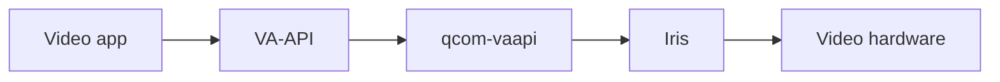

# qcom-vaapi

Hardware video decoding for **Snapdragon X Elite (X1E80100)** on Linux.
This Rust VA-API driver connects video apps to Qualcomm Iris through V4L2.
Other Qualcomm chips are untested.

## Current state

**RC10 is a development candidate.** It combines reduced CPU frame copies and
experimental 8K support. The latest published release is
[RC6](https://github.com/quanlou/qcom-vaapi/releases/tag/v0.1.1-rc.6).
RC10 has not completed hardware qualification or been released.

| RC10 change | State |
| --- | --- |
| Direct DMA-BUF decoding | H.264 / HEVC where layouts match |
| GPU frame transfers | Replaces CPU publication when supported |
| Experimental 8K | AV1 pixels and 5 fps playback passed on an earlier build |
| Sustained 8K30 | Earlier CPU build failed; combined GPU build pending |
| Session reuse | VP9 / Iris faults remain unresolved |

"No CPU copy" concerns decoded-frame publication. GPU transfers still move
pixels. Unsupported layouts can use CPU fallback, and requested CPU images
require readback. See [GPU transfers](docs/gpu-copy.md) and
[RC10 details](docs/releases/0.1.1-rc.10.md).

| Codec | Profiles |
| --- | --- |
| H.264 | Baseline, Main, High |
| HEVC | Main, Main10 |
| VP9 | Profile 0 |
| AV1 | Experimental Profile 0; 8-bit, no film grain |

Normal builds retain a 4096-pixel maximum side. The `experimental-8k` variant
admits the Iris 8K frame envelope with allocation limits. Sustained Firefox /
Chrome 4K60, 8K30/60, other chips and broad suspend/resume reliability remain
unqualified. Kernel teardown/SMMU faults are still under investigation.

## Install the published release

Download the `.deb` from the [RC6 release](https://github.com/quanlou/qcom-vaapi/releases/tag/v0.1.1-rc.6), then:

```sh
sudo apt install ./qcom-vaapi_0.1.1.rc.6_arm64.deb
```

Requirements: ARM64, X1E80100, `libc6 >= 2.44`, `libva2 >= 2.24`, and a
compatible Iris kernel and firmware. The tested system is Ubuntu 26.10
development with patched `7.3.0-15-qcom-x1e` modules. The package installs
userspace libraries; it does not install firmware or activate kernel patches.
The included power helper is disabled by default.

Restart video apps and check `vainfo`. RC6 reports `qcom-vaapi 0.1.1-rc.6`
and `VAProfileAV1Profile0`. Remove it with `sudo apt remove qcom-vaapi`.
See [RC6 release details](docs/releases/0.1.1-rc.6.md) for sources and limitations.

## How it works



libva loads `msm_drv_video.so` because the platform DRM driver is named `msm`.
The driver discovers the decoder node automatically. Exported surfaces retain
stable storage for browser use.

## Build RC10

A recent Rust toolchain is required. Build the combined candidate privately:

```sh
V4L2_VA_BUILD_FEATURES='system-av1 gpu-copy experimental-8k' \
  ./tools/build-rust-driver.sh /tmp/qcom-vaapi-rc10
```

Omit `experimental-8k` for the normal frame limit; omit `gpu-copy` for the
existing CPU fallback build. AV1 also requires `libiris_av1_complete.so`;
see [companion build instructions](docs/releases/0.1.1-rc.5.md#build-the-av1-companion).
GPU transfers require Adreno, EGL, GLES 3.1 and GBM.

Package the built libraries on ARM64:

```sh
python3 tools/package-deb.py \
  --driver /tmp/qcom-vaapi-rc10/msm_drv_video.so \
  --companion /path/to/libiris_av1_complete.so \
  --ffmpeg-source /path/to/ffmpeg-source \
  --output /tmp/qcom-vaapi-package
```

The package includes license notices and detected dependencies. GPU variants
also depend on EGL, GLES and GBM runtime libraries. Build on the oldest target
distribution and qualify the resulting binary on its actual hardware.

## Validate

Close video apps and use a clean boot with the documented fixtures:

```sh
./tools/verify-rust-driver.sh /tmp/qcom-vaapi-rc10
./tools/verify-session-churn.sh /tmp/qcom-vaapi-rc10
```

Keep the required 1 / 30 / full-frame comparisons and export checks. Hardware
faults stop testing before another decoder session. The full deployment gate
is `tools/verify-production.sh`; GitHub Actions runs the host checks.
