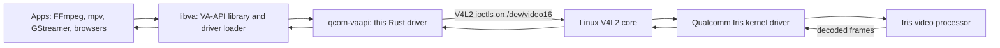

# qcom-vaapi

A Rust VA-API backend for Qualcomm Iris video decoding through Linux V4L2.

It currently targets Qualcomm's Iris stateful V4L2 M2M decoder on the
Snapdragon X Elite X1E80100. libva derives the driver name `msm` from the DRM
driver on this platform, so the loadable module must remain named
`msm_drv_video.so`.

The `qcom-vaapi` name describes the vendor/API area, not a promise of support
for every Qualcomm decoder. Current hardware support is limited to Iris on the
X1E80100; other Qualcomm video blocks and SoCs are not implied to work.

**Current scope:** H.264 Baseline/Main/High, HEVC Main, HEVC Main10, and VP9
Profile 0 decode to NV12 or P010 as appropriate; CPU-copy output through
`vaCreateImage`/`vaGetImage`/`vaDeriveImage`; and a read-only DRM PRIME export
path for ready V4L2 CAPTURE buffers. AV1 remains experimental and unadvertised
by default until full-stream reference parity passes. Browser-grade zero-copy
rendering is not established merely by browser playback or PRIME export.

## What this project is

This is a **user-space VA-API driver**: it translates the standard interface
used by Linux video applications into commands for Qualcomm's Iris decoder. It
is neither the decoder hardware nor the kernel driver. Apps provide compressed
video and decode parameters; Iris returns decoded NV12 or P010 video surfaces.



**Upstream dependencies** are the interfaces and components this driver builds
on: libva's driver ABI, Linux's V4L2 decoder interface, and the Iris kernel
driver. **Downstream consumers** are applications and media libraries that use
VA-API, including FFmpeg, mpv, GStreamer, Chromium, and Firefox. Here,
“upstreaming” can also mean contributing code back to a project's canonical
repository; this driver is a separate project, not a patch to libva or Linux.

FFmpeg's `h264_v4l2m2m` decoder is a **sibling path**, not a dependency: it
speaks V4L2 directly and bypasses both libva and this driver. Its output is used
as a reference when checking that this driver's VA-API-to-V4L2 translation
produces matching frames.

## Production readiness

This driver is not yet qualified for unrestricted production use. The v13
kernel fix passed strict correctness/lifecycle checks and ordinary runtime
power-management checks on the current boot. Sustained 4K pixel parity reached
50.66 FPS with 468 MiB peak process RSS, below the 512 MiB budget. Chromium
passed playback, seeking and clean shutdown. Firefox is explicitly deferred
and unsupported for this release; AV1 remains unadvertised. System sleep,
live module removal and permanent deployment remain unqualified. Failed
evidence is preserved and known faulted boots remain excluded.
See [the current continuation record](docs/production-next-cold-20261002.txt)
and [the production review](docs/production-review.txt) for evidence and limits.

Use the release gate before deployment:

```sh
V4L2_VA_SAMPLE=/path/to/sample.mp4 ./tools/verify-production.sh /tmp/libva-v4l2-production-driver
```

Supply the edge and codec fixtures documented below through their environment
overrides. This gate requires every headless probe, full-stream GL pixel coverage,
HEVC/Main10/VP9 parity, EOS, seek, and session churn. Missing fixtures, skipped
probes, pipeline failures, and expected decode failures fail the gate. Browser
playback still requires the separate browser probe in the deployment session.
Hardware-free Rust and verifier regression checks run in GitHub Actions.

These results are scoped to the tested kernel, module, browser, codecs, and
fixtures. Firefox, active-playback suspend/resume, live module removal, and
permanent deployment are not qualified. AV1 remains experimental and
unadvertised pending VA-API producer integration and full-stream parity.

## Documentation

New to Linux video drivers, VA-API, or this codebase? Start here — a
progressive "book" with PlantUML diagrams, written for beginners:

- [docs/README.md](docs/README.md) — index & learning path
- [PROGRESS.md](PROGRESS.md) — short handoff file for active work and verifier status
- [Background primer](docs/01-primer.md) — video, hardware, and Linux basics
- [The big picture](docs/02-stack.md) — the full stack and driver loading
- [VA-API crash course](docs/03-vaapi-tutorial.md) — object model & decode lifecycle
- [Tour of the code](docs/04-code-tour.md) — how this driver works, file by file
- [Upstream & downstream](docs/05-upstream-downstream.md) — ecosystem map
- [Roadmap, explained](docs/06-roadmap.md) — what's left and why
- [Write your own driver](docs/07-write-your-own-driver.md) — the reusable recipe

## Build

Build the Rust driver into an isolated libva driver directory:

```sh
./tools/build-rust-driver.sh /tmp/libva-v4l2-rust-driver
```

The helper compiles `rust/` in release mode and copies
`rust/target/release/libmsm_drv_video.so` to
`/tmp/libva-v4l2-rust-driver/msm_drv_video.so`, which is the filename libva
expects.

## Test without installing

```sh
LIBVA_DRIVERS_PATH=/tmp/libva-v4l2-rust-driver \
  vainfo --display drm --device /dev/dri/renderD128
```

Expected profiles:

- `VAProfileH264ConstrainedBaseline : VAEntrypointVLD`
- `VAProfileH264Main : VAEntrypointVLD`
- `VAProfileH264High : VAEntrypointVLD`
- `VAProfileHEVCMain : VAEntrypointVLD`
- `VAProfileHEVCMain10 : VAEntrypointVLD`
- `VAProfileVP9Profile0 : VAEntrypointVLD`

Run the full local verification script:

```sh
./tools/verify-rust-driver.sh /tmp/libva-v4l2-rust-driver
```

The script runs Rust unit tests, builds the isolated driver, checks `vainfo`,
compares a H.264 framemd5 matrix against native `h264_v4l2m2m`, verifies
mixed-resolution and sustained playback, and compares codec-expansion output
against reference decoders. HEVC Main and VP9 use native V4L2 references;
HEVC Main10 uses software HEVC converted to P010 because FFmpeg's
`hevc_v4l2m2m` wrapper does not produce valid Main10 frame rows on this
platform. It records DRM PRIME/export probe logs under
`/tmp/libva-v4l2-verify/`. The required H.264 matrix covers one decoded frame,
30 decoded frames, and the full 300-frame 720p sample.
The baseline verifier also keeps stricter local probes visible: the one-frame
EOS file is skipped when native V4L2 produces no frame rows, and
`bframes-240p.mp4` is reported as
an expected failure until the remaining H.264 synthesis edge is fixed. When
GStreamer VA and OpenGL plugins are available, the script also runs
`tools/verify-gst-export.sh`, which decodes one frame through
`vah264dec ! glupload` and verifies that `vaExportSurfaceHandle` is reached.
Set `V4L2_VA_GST_EXPORT_BUFFERS=N` to make that probe ask GStreamer for more
output buffers during manual stress testing.

Exercise same-decoder resolution changes separately:

```sh
./tools/verify-resolution-churn.sh /tmp/libva-v4l2-rust-driver
```

The probe concatenates 960x640 and 1280x720 H.264 clips twice and decodes the
playlist in one FFmpeg VAAPI-copy process. It requires every frame, at least
four driver `SOURCE_CHANGE` events, no Iris firmware fault, and a matching
post-run sanity decode. The main verifier runs it after the required framemd5
and export probes.

Run the graphical browser probe separately when a display session is available:

```sh
V4L2_VA_BROWSER_SECONDS=12 \
  ./tools/verify-browser-vaapi.sh /tmp/libva-v4l2-rust-driver

V4L2_VA_BROWSER=firefox V4L2_VA_BROWSER_SECONDS=12 \
  ./tools/verify-browser-vaapi.sh /tmp/libva-v4l2-rust-driver
```

This probe serves the sample from localhost, uses a fresh browser profile, and
looks for a driver call in the browser log. It is intentionally separate from
the headless verifier because browser GPU-process setup and sandbox packaging
are host-specific. Chromium also needs the legacy `__vaDriverInit_1_0` symbol;
the Rust driver exports it alongside the current libva init symbol. The result
also identifies software FFmpeg fallback separately from a browser driver call.

Manual 30-frame correctness check against native libavcodec V4L2 decode:

```sh
LIBVA_DRIVERS_PATH=/tmp/libva-v4l2-rust-driver \
ffmpeg -hide_banner -v warning \
  -hwaccel vaapi -hwaccel_device /dev/dri/renderD128 \
  -i test.mp4 -map 0:v:0 -frames:v 30 -f framemd5 rust-va.md5

ffmpeg -hide_banner -v warning \
  -c:v h264_v4l2m2m \
  -i test.mp4 -map 0:v:0 -frames:v 30 -f framemd5 native-v4l2.md5

cmp rust-va.md5 native-v4l2.md5
```

## Install system-wide

```sh
sudo cp /tmp/libva-v4l2-rust-driver/msm_drv_video.so /usr/lib/aarch64-linux-gnu/dri/
```

## Environment variables

- `V4L2_VA_STRICT=1` — make skipped probes and edge decode failures fatal in
  `verify-rust-driver.sh`; `verify-production.sh` enables this automatically.
- `V4L2_VA_PRODUCTION_DIR=...` — output logs for the production release gate.
- `V4L2_VA_ONE_FRAME_SAMPLE=...` and `V4L2_VA_BFRAMES_SAMPLE=...` — edge fixtures.
- `V4L2_VA_CODEC5_DIR=...` — HEVC/Main10/VP9 fixture directory.

- `V4L2_VA_DEBUG=1` — verbose Rust driver tracing.
- `V4L2_VA_DEVICE=/dev/video16` — override the V4L2 device node.
- `V4L2_VA_DUMP=/tmp/frame` — dump assembled Annex-B frames as
  `/tmp/frame_00.bin`, `/tmp/frame_01.bin`, ... for replay/debugging.
- `V4L2_VA_GST_EXPORT_BUFFERS=1` — number of buffers requested by
  `tools/verify-gst-export.sh`; increase manually for export/import stress.
- `V4L2_VA_GST_EXPORT_HOLD_MS=0` — delay each imported GStreamer buffer before
  release; combine with a larger `V4L2_VA_GST_EXPORT_BUFFERS` value to stress
  exported-buffer lifetime. Hold mode uses a bounded leaky side branch so
  downstream delay does not stop decoder input. The probe requests a graceful
  interrupt before force-killing a timed-out GStreamer pipeline.
- `V4L2_VA_RESOLUTION_LOW_SAMPLE=...` and
  `V4L2_VA_RESOLUTION_HIGH_SAMPLE=...` — override the two clips used by
  `tools/verify-resolution-churn.sh`.
- `V4L2_VA_RESOLUTION_DIR=...` — scratch directory for the resolution probe's
  FFmpeg logs and temporary playlist files.
- `V4L2_VA_BROWSER=chromium` — browser executable selected by
  `tools/verify-browser-vaapi.sh`; `firefox` is also supported.
- `V4L2_VA_BROWSER_SECONDS=20` — timeout for the graphical browser probe.
- `V4L2_VA_BROWSER_CHROMIUM_MODE=auto` — use `in-process` to test Chromium's
  alternate GPU setup when the packaged browser disables its GPU process.
- `V4L2_VA_BROWSER_WORK_DIR=...` — browser-visible scratch directory override.
- `V4L2_VA_SAMPLE=...` — sample video used by the browser probe.

## Design notes

- Codec-specific Rust modules translate parsed VA parameters and slice data
  into complete coded access units. H.264 synthesizes SPS/PPS, HEVC synthesizes
  VPS/SPS/PPS for supported Main/Main10 stream shapes, and VP9 forwards the
  complete compressed frame supplied by VA.
- The V4L2 flow selects H.264, HEVC, or VP9 on OUTPUT, configures CAPTURE as
  NV12 or P010 from the VA profile, queues compressed frames, pumps DQBUF, and
  binds CAPTURE buffers back to VA surfaces.
- CAPTURE buffers are returned to the decoder when libav reuses a VA surface,
  preventing CAPTURE pool starvation during threaded decode.
- The unsafe boundary is limited to libva/V4L2/mmap FFI. Driver-owned VA state,
  codec assembly, buffer ownership, and surface bookkeeping live in Rust data
  structures.

## Latest qualification snapshot — 2026-10-01

Recovery-v4 passed the required H.264 1/30/300 parity, strict GL 300/300,
resolution churn (780 frames), long playback (3,600 frames), 30-frame HEVC,
Main10 and VP9 parity, edge clips, churn (7/7), EOS, and 24 ordinary seeks,
with clean observed kernel windows. It failed mixed seeks on the supplied
transport stream. An indexed Matroska remux passed all 12 mixed seeks without
changing the hardware checks, but that does not erase the strict-gate failure.
Recovery-v5 is running the full strict gate with the indexed fixture; no result
is claimed until that run completes. See [the detailed run record](docs/production-resumption-20261001.txt).

Still pending after the strict gate: sustained 4K and browser performance checks
on the deployment session, persistent kernel deployment, and AV1 producer-data
support plus broad full-stream parity. The supplied one-frame and B-frame edge
fixtures passed in recovery-v4; broader small-stream reliability and the
historical firmware failures remain under investigation. Historical probes are
tied to their recorded binaries and do not qualify the current release.
