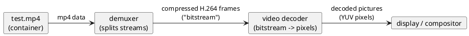
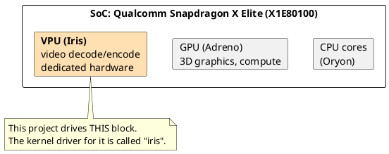
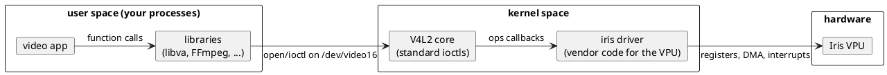
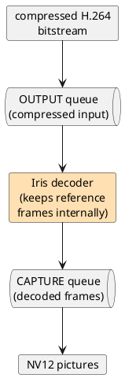

# 01 · Background primer: video, hardware, and Linux

*No prior driver or graphics knowledge assumed. If you already know what
V4L2, ioctls and NV12 are, skim this chapter and move on.*

---

## 1. What actually happens when you press "play"

A movie file, say `test.mp4`, is a **container** — a ZIP-like package
that holds several streams (video, audio, subtitles) plus metadata.

The video stream inside is not pixels. It is **compressed** by a *codec*
(H.264, HEVC, VP9, AV1, …). Compression works by storing only what
changes between frames:

- an **I-frame** (keyframe) is a complete picture;
- a **P-frame** stores only *differences* from a previous frame;
- a **B-frame** stores differences from frames *before and after* it.



The **decoder** is the star of this whole project: its input is a stream
of compressed bytes (the "bitstream"), and its output is a sequence of
pictures in **YUV** format — specifically `NV12` in our case, which
stores luma (brightness) and chroma (color) in two planes.

Two details that will matter later:

1. **Display order ≠ decode order.** Because of B-frames, frames must be
   fed to the decoder in *decode* order but shown in *display* order.
   Decoders tag each output picture with a presentation timestamp.
2. **P- and B-frames reference other frames.** A real decoder must keep
   several recently decoded pictures around as "reference frames" to
   decode the next ones. This is why the hardware — not just the API —
   has *state*.

## 2. Why hardware decoding

Decoding 1080p/4K H.264 in software on a CPU works, but it burns CPU
cores and battery. Every modern SoC therefore has a dedicated **video
processor (VPU)**: a small fixed-function (or heavily hardened) engine
that decodes video at a fraction of the power.

On a Snapdragon X Elite (X1E80100) there are three relevant big blocks:



Historical naming note: Qualcomm's older VPU driver in Linux is called
**Venus** (for older SoCs). **Iris** is the newer generation, first
mainlined in Linux 6.15 for SM8550 and extended to laptop chips like the
X1E80100 in later kernels.

## 3. How Linux talks to hardware (the 5-minute version)

Linux protects hardware from processes: user-space code may **not**
touch devices directly. Everything goes through the **kernel**, and the
kernel code that knows how to operate one device is a **driver**.

Drivers expose devices to user space through standard interfaces:

- **Device nodes** — files under `/dev` (e.g. `/dev/video16`). A program
  `open()`s the file and then talks a protocol.
- **System calls** — most importantly `ioctl()` ("input-output control"):
  a generic "do command X on this file descriptor" call. Entire device
  APIs are defined as sets of ioctl commands.
- **Memory sharing** — `mmap()` maps device memory into your process;
  **dmabuf** passes buffers between devices/processes without copying.

Subsystems group drivers of the same kind behind one standard API:

| Subsystem | Standard API | Used for | On this machine |
|---|---|---|---|
| V4L2 (Video4Linux 2) | ioctls on `/dev/videoN` | cameras, video decode/encode | `/dev/video16` = Iris decoder |
| DRM/KMS | ioctls on `/dev/dri/*` | GPUs, displays | `/dev/dri/renderD128` = Adreno GPU |



**Key insight for this project:** the "driver" in this repository is
*not* a kernel driver. It is an ordinary user-space shared library
(`.so`). The actual kernel driver (`iris`, written by Qualcomm) already
exists. Our library *drives* it using the public V4L2 API — it is a
**translation layer**, and writing it requires no kernel programming at
all.

## 4. What a hardware video decoder looks like (conceptually)

A V4L2 hardware decoder exposes **two queues** on one file descriptor:



- You push compressed data into the **OUTPUT** queue.
- Decoded pictures come out of the **CAPTURE** queue.
- The decoder is **stateful**: it parses the bitstream, manages
  reference frames, and even *renames* things for you — you feed it
  frames in decode order and it hands back pictures it tags with
  timestamps. ("Stateless" decoders push all that work back to
  user space; see [chapter 7](07-write-your-own-driver.md#8-choosing-your-stack-stateful-stateless-and-alternatives).)

The decoder also talks back through **events**:

- `SOURCE_CHANGE` — "the video just changed resolution" (common on TV
  streams when ads start).
- `EOS` — "end of stream, that was the last frame" (after you ask it to
  drain).

## 5. The problem this repo exists to solve

Desktop Linux apps do **not** speak V4L2 for video decode. They speak
**VA-API** (through the `libva` library) — a vendor-neutral API where an
app says things like "here are the parsed H.264 parameters for this
frame, decode it into that surface".

So on this machine there are two adjacent standards that nobody had
connected yet:

```
VA-API (what apps use)  ←———  ???  ———→  V4L2 stateful decoder (what Iris offers)
```

This repository, **qcom-vaapi**, is the `???`: `msm_drv_video.so`, a Rust
library loaded by libva, translating every VA-API call into V4L2 ioctls. The name
`msm` comes from the GPU/DRM driver name libva discovers on Qualcomm
platforms (explained in [chapter 2](02-stack.md#3-how-libva-finds-and-loads-this-driver)).

The translation is *not* purely mechanical — the two APIs describe the
world differently (VA-API hands over *parsed parameters*; a stateful V4L2
decoder wants a *complete bitstream*). Bridging that gap — including
re-synthesizing H.264 headers — is most of the interesting code, and
[chapter 4](04-code-tour.md) walks through all of it.

## 6. Glossary: the jargon decoder ring

| Term | Meaning |
|---|---|
| **codec** | Algorithm that compresses/decompresses video (H.264, HEVC, VP9, AV1) |
| **container** | File format bundling streams (MP4, MKV, WebM) |
| **bitstream** | The compressed video bytes themselves |
| **NAL unit** | Chunk of H.264/HEVC bitstream (headers and slices are NAL units) |
| **SPS / PPS** | "Sequence/Picture Parameter Set" — H.264 header NAL units describing the stream and picture settings |
| **Annex-B** | The raw H.264 byte format where NAL units are prefixed with start codes `00 00 00 01` |
| **I / P / B frame** | Keyframe / forward-difference / bidirectional-difference frame |
| **YUV / NV12** | Pixel formats. NV12 = 8-bit luma plane + interleaved half-size chroma plane (1.5 bytes/pixel) |
| **stride / pitch** | Row width in bytes, often padded wider than the picture |
| **VPU** | Video processing unit — dedicated decode/encode hardware |
| **DRM** | Linux subsystem for GPUs/displays (unrelated to digital rights management) |
| **render node** | `/dev/dri/renderDNNN` — DRM device for offscreen GPU work |
| **V4L2** | Video4Linux 2 — kernel API for video devices |
| **M2M** | "memory-to-memory" — device that takes input buffers and produces output buffers (vs. a camera that captures live signal) |
| **stateful / stateless** | Decoder keeps stream state itself (stateful) vs. user space provides all parsed state per frame (stateless) |
| **ioctl** | System call: "perform command X on this file descriptor" |
| **mmap** | Map memory (incl. device buffers) into your address space |
| **dmabuf** | Linux mechanism to share buffers across devices/processes without copying |
| **VA-API** | Video Acceleration API — the standard accelerated-video API on Linux desktops |
| **libva** | The reference VA-API implementation: stub library + runtime-loaded vendor drivers |
| **profile / entrypoint** | VA-API terms: which codec (H264 High…) and which operation (VLD = bitstream decode) |
| **surface** | VA-API name for a decoded-picture container |
| **vtable** | Struct of function pointers — how libva calls into a driver |
| **framemd5** | FFmpeg output format that hashes each decoded frame — used to compare two decoders byte-for-byte |

---

*Next: [chapter 2 — the full stack and how the pieces find each other](02-stack.md).*
