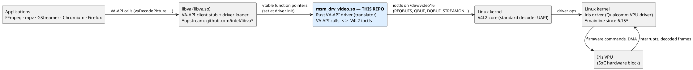
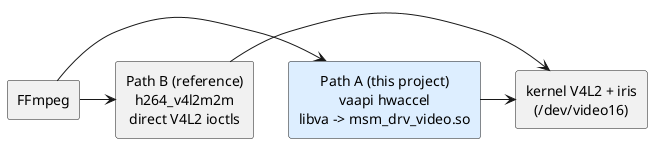
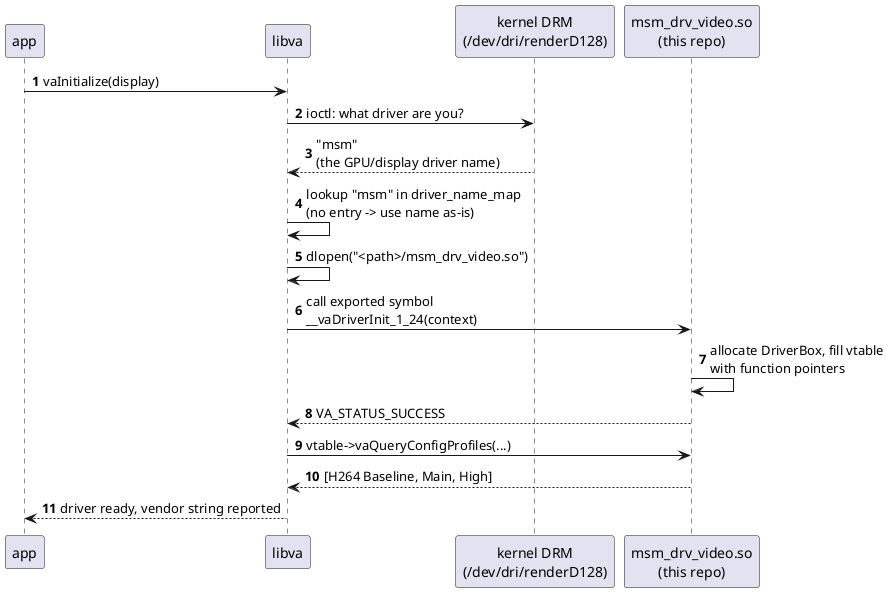
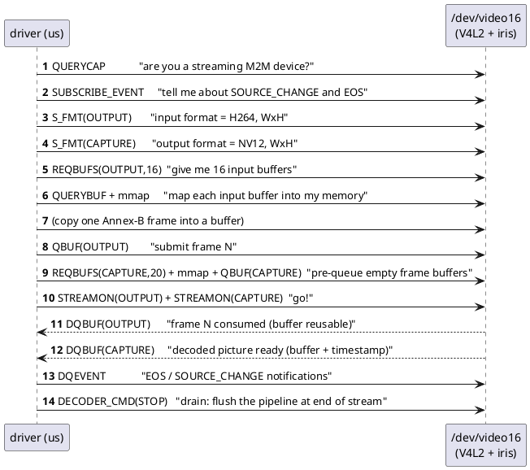

# 02 · The big picture: the whole stack and where this repo sits

*Goal of this chapter: you can draw the entire stack from a browser down
to silicon, name every box, and explain how they find each other.*

---

## 1. The full stack, annotated

Who owns what:

| Layer | Project / file | Written in | Role |
|---|---|---|---|
| App | FFmpeg, mpv, Chromium, Firefox | C/C++ | Requests decode via VA-API |
| Client library | **libva** | C | Defines VA-API; finds & loads drivers; forwards calls via a vtable |
| **Driver** | **this repo: `rust/`** | **Rust** | Translates VA-API ↔ V4L2; owns surfaces/buffers bookkeeping |
| Kernel core | V4L2 core | C | Generic decoder state machine, buffer queuing (`videobuf2`) |
| Kernel driver | **iris** (`drivers/media/platform/qcom/iris`) | C | Qualcomm's driver for the Iris VPU |
| Hardware | Iris VPU | silicon | Does the actual H.264 decoding |

## 2. The sibling path: FFmpeg's direct V4L2 decoder

FFmpeg ships `h264_v4l2m2m`, a decoder that skips VA-API and libva
entirely and talks V4L2 itself:

Path B has existed for years and is known-good on this hardware. That is
why the project's correctness bar is **byte-for-byte parity with
`h264_v4l2m2m`**: decode the same file through both paths and compare
per-frame hashes (`framemd5`). If both paths produce identical output,
our translation layer is provably not corrupting anything. You will see
this test in every chapter that follows — it is the project's compass.

## 3. How libva finds and loads this driver

This is the piece that confuses everyone at first. Nothing is
"registered"; libva *discovers* the driver at runtime, every time:

Consequences worth internalizing:

1. **The filename is load-bearing.** Because the DRM driver is `msm` and
   the VA-API convention is `<name>_drv_video.so`, the build script
   renames the Rust output to exactly `msm_drv_video.so`
   (`tools/build-rust-driver.sh`).
2. **`__vaDriverInit_1_24` is the only exported symbol.** The suffix is
   the VA-API ABI version libva was built with (see `va/va_backend.h`).
   If a future libva bumps it, this symbol name must be updated —
   that's in `rust/src/lib.rs` (`#[unsafe(no_mangle)] pub unsafe extern "C" fn __vaDriverInit_1_24`).
3. **`vainfo` is the "hello world".** `vainfo` initializes the display,
   triggers the loading above, and asks the driver for profiles. When it
   prints the three H.264 profiles, the whole chain works.
4. The DRM name lookup happens even though the GPU does **no** video
   decoding here. The name is just a *label* libva uses to pick a
   driver; the label on Qualcomm machines happens to be `msm` because
   that's the GPU/DRM driver. Our driver ignores the GPU completely and
   drives the VPU through V4L2.

## 4. What "stateful V4L2 M2M" means

[M2M](01-primer.md#6-glossary-the-jargon-decoder-ring) = memory-to-memory:
buffers in, buffers out (as opposed to a camera, which captures a live
signal). **Stateful** = the device keeps the codec state (reference
frames, parsing position) internally. The Linux kernel documents this
contract in `Documentation/userspace-api/media/v4l/dev-decoder.rst`;
the essential conversation is:

Two queues run **asynchronously**: you can queue several OUTPUT frames
before the first CAPTURE picture appears (the hardware pipelines, and
H.264 reorder frames). Matching a decoded CAPTURE buffer back to "which
request was this?" is done with **timestamps** — this project stamps
each submitted frame with a derived presentation timestamp and matches
CAPTURE buffers against a FIFO of pending frames (details in
[chapter 4](04-code-tour.md#6-v4l2rs-driving-the-kernel-decoder)).

Buffer recycling is the name of the game: buffers are expensive
(pre-allocated, mmap'd), so they circulate — OUTPUT buffers return via
`DQBUF` and get refilled; CAPTURE buffers return to the decoder via
`QBUF` once nobody needs the picture anymore.

## 5. Device nodes on this machine, and the debug dials

| Node | What | Used for |
|---|---|---|
| `/dev/dri/renderD128` | Adreno GPU render node (DRM driver `msm`) | Name discovery for libva; GPU import later |
| `/dev/video16` | Iris stateful decoder (V4L2 M2M) | Everything this driver does |

Environment variables understood by this driver (from `README.md`):

| Variable | Effect |
|---|---|
| `V4L2_VA_DEBUG=1` | Verbose tracing of every V4L2 queue/dequeue event |
| `V4L2_VA_DEVICE=/dev/videoNN` | Use a different decoder node |
| `V4L2_VA_DUMP=/tmp/frame` | Dump every assembled Annex-B frame to `/tmp/frame_NN.bin` for offline inspection |

Tip: `v4l2-ctl -d /dev/video16 --all` and `--list-formats-ext` are
invaluable for seeing what the kernel driver claims to support.

---

*Next: [chapter 3 — the VA-API side of the conversation](03-vaapi-tutorial.md).*
