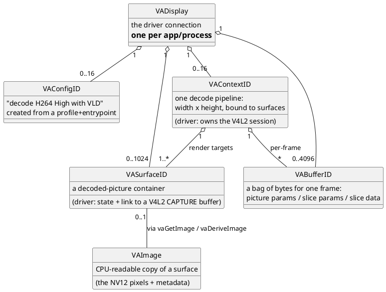
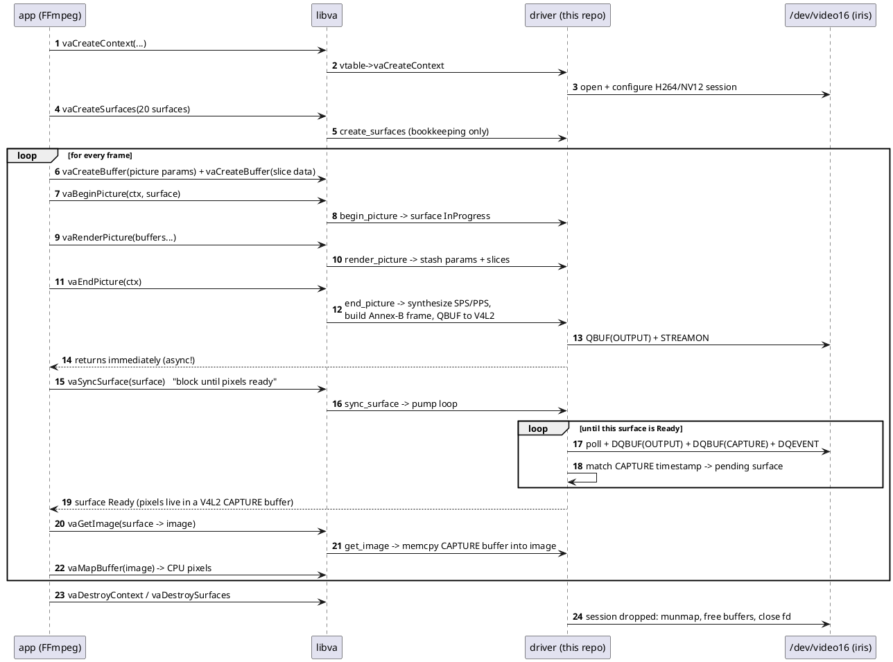
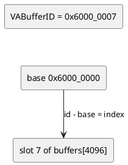

# 03 · VA-API crash course (from the driver's point of view)

*Goal: understand every VA-API concept this driver implements, and the
exact life of a decoded frame. Everything here maps 1:1 onto code shown
in [chapter 4](04-code-tour.md).*

---

## 1. The object model

VA-API is an object-oriented-looking C API. A decode session creates a
chain of objects:

The vocabulary that scares newcomers:

- **Profile** — which codec flavor: `VAProfileH264High`, `VAProfileH264Main`,
  `VAProfileH264ConstrainedBaseline` (the three this driver reports).
- **Entrypoint** — what operation: `VAEntrypointVLD` means "bitstream
  decode" (VLD = variable-length decoding). Encoding would be
  `VAEntrypointEncSlice`, etc.
- **Config** — a frozen (profile, entrypoint, attributes) bundle. Apps
  create it once, e.g. to ask "what RT format do you support?" (answer:
  YUV420/NV12).
- **Context** — one decode pipeline for one video stream at one
  resolution. **This is where the driver opens `/dev/video16`** —
  one V4L2 session per context (`create_context` in `lib.rs`).
- **Surface** — a picture slot the app allocates in advance (FFmpeg
  typically allocates 20+ so decode can run ahead). In this driver a
  surface is *not* memory — it is bookkeeping: dimensions, a state
  machine, and later a link ("`cap_idx`") to a V4L2 CAPTURE buffer that
  holds the real pixels.
- **Buffer** — the per-frame input payload. VA-API drivers receive
  *parsed* data: a **picture parameter** struct (the H.264 header fields,
  already extracted), an **IQ matrix**, **slice parameter** structs, and
  raw **slice data** bytes.
- **Image** — a CPU-mappable NV12 copy of a surface. This is how FFmpeg's
  `vaapi-copy` path (and, for now, our whole output path) gets pixels out.

## 2. The life of a decoded frame

Things worth pausing on:

- **`vaEndPicture` does not decode anything synchronously.** It enqueues.
  Decoding progress only happens when *someone pumps the device* — in
  this driver, that someone is `vaSyncSurface` (and, briefly, the
  submission path when OUTPUT queue backpressure forces it).
- **The app drives the pace.** VA-API has no background threads in this
  driver; the polling loop lives inside `vaSyncSurface` with a 10-second
  timeout, pumping `DQBUF`s every iteration.
- **One frame = several buffers.** FFmpeg may hand over picture params,
  IQ matrix, N slice-parameter entries, then slice data in separate
  `vaRenderPicture` calls. The driver reassembles them.

## 3. Stateful V4L2 vs VA-API: the impedance mismatch

This is *the* architectural insight of the whole project:

| | VA-API (what libva gives us) | stateful V4L2 (what Iris wants) |
|---|---|---|
| Bitstream | **Parsed fields** (structs) + raw slice bytes; SPS/PPS not guaranteed present | **Complete Annex-B stream**; the device parses SPS/PPS itself |
| Headers | App sends SPS/PPS contents as scattered struct fields | Must appear as NAL units in the stream |
| Ordering | One "picture" per begin/render/end cycle | Continuous byte stream; device owns the timeline |
| Output | Surface (API object) | CAPTURE buffer (memory) |

So the driver must **manufacture SPS/PPS NAL units** from the parsed
struct fields on every change (first frame, or parameter change, or
frame_num wrap) and glue them in front of the raw slice bytes — that is
`rust/src/h264.rs`, a small H.264 bitstream writer. See
[chapter 4 §5](04-code-tour.md#5-h264rs-the-header-synthesis-problem).

## 4. Handles and IDs — how libva talks to our objects

All VA-API object handles are just numbers. This driver mints IDs by
reserving a base per object type and using the slot index as the offset
(`lib.rs`, `DRV_ID_BASE_*` constants):

Every callback starts the same way: validate the ID range, subtract the
base, index into the slot table (`config_index`, `surface_index`, … in
`lib.rs`). Slot tables are `Vec<Option<T>>` — `None` = free slot.

## 5. What a driver must implement: the vtable

`__vaDriverInit_1_24` fills `VADriverVTable` — a struct of ~60 function
pointers. This driver's status (from `install_vtable`, `vtable.rs`):

| VA-API call | Our function | Status / role |
|---|---|---|
| `vaTerminate` | `terminate` | drop the driver state |
| `vaQueryConfigProfiles` / `Entrypoints` | implemented | report 3× H264, VLD |
| `vaGetConfigAttributes` / `CreateConfig` / `DestroyConfig` / `QueryConfigAttributes` | implemented | config bookkeeping |
| `vaQuerySurfaceAttributes` / `vaCreateSurfaces(2)` / `vaDestroySurfaces` | implemented | surface slots (no memory!) |
| `vaCreateContext` / `vaDestroyContext` | implemented | **opens/closes the V4L2 session** |
| `vaCreateBuffer` / `vaMapBuffer` / `vaUnMapBuffer` / `vaDestroyBuffer` / `vaBufferInfo` | implemented | buffers = plain `Vec<u8>` |
| `vaBeginPicture` / `vaRenderPicture` / `vaEndPicture` | implemented | the decode submission path |
| `vaSyncSurface(2)` | implemented | **the pump loop** (10 s timeout) |
| `vaQuerySurfaceStatus` / `vaQuerySurfaceError` | implemented | surface state exposure |
| `vaCreateImage` / `vaDestroyImage` / `vaGetImage` / `vaDeriveImage` | implemented | CPU-copy output path |
| `vaQueryImageFormats` | implemented | NV12 only |
| `vaAcquireBufferHandle` / `vaReleaseBufferHandle` | stub-ish | reports unsupported (no buffer export yet) |
| `vaExportSurfaceHandle` | `export_surface_handle` | **initial dmabuf export**: read-only DRM PRIME 2 NV12 from a ready surface (roadmap phase 3 groundwork; lifetime hardening ongoing) |
| everything else (subpictures, VPP, `vaPutSurface`, …) | typed rejection callbacks | returns `VA_STATUS_ERROR_UNIMPLEMENTED` |

A driver is allowed to say "unimplemented" — real clients mostly avoid
those paths or fall back gracefully. Knowing *which* stubs matter for
which client is exactly what the [roadmap's browser phase](06-roadmap.md#3-phase-3—dmabuf-zero-copy-what-browsers-need) is about.

## 6. Concurrency model in one paragraph

libva may be called from multiple threads (FFmpeg decodes with several
threads). All driver state sits behind one `Mutex<DriverState>`
(`DriverBox` in `lib.rs`), so every callback is serialized. The pump
loop in `sync_surface` deliberately **drops the lock around `poll()`**
so another thread can make progress while we wait. Not elegant, but
honest — and a good example of "correct first, fancy later".

---

*Next: [chapter 4 — the same story again, now with line numbers](04-code-tour.md).*
