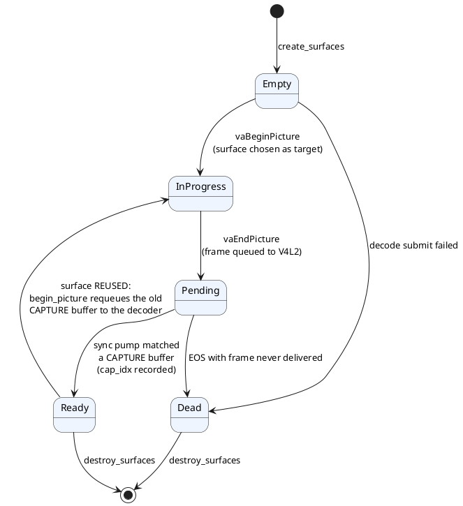
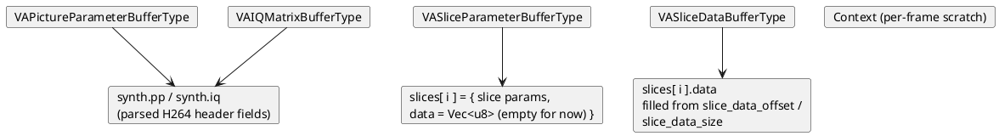
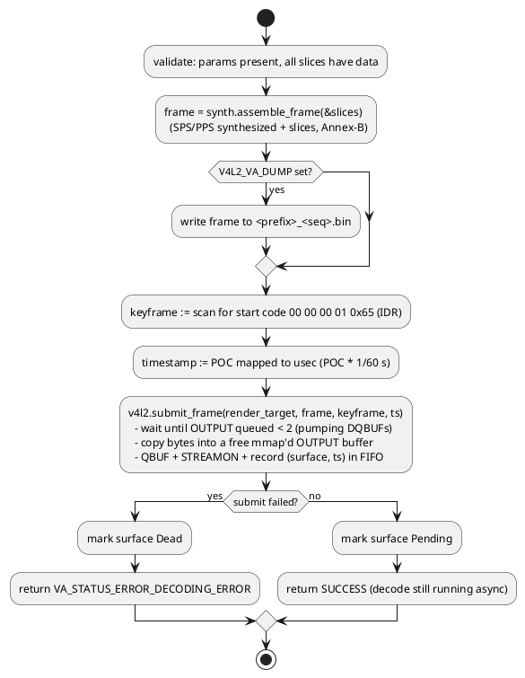
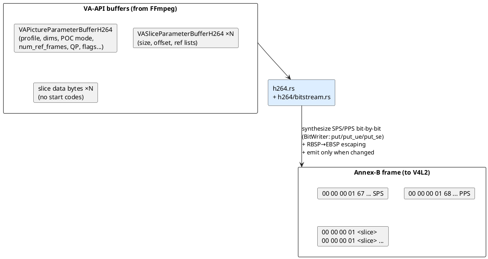
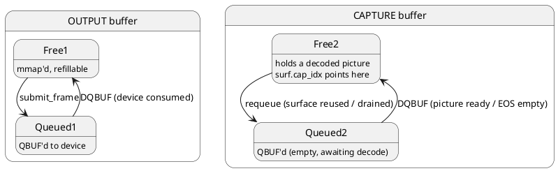

# 04 · Tour of the code: how `msm_drv_video` really works

*This chapter walks the actual source. File references use
`rust/src/<file>.rs`. Keep [chapter 3](03-vaapi-tutorial.md) open in
another tab — the concepts land here.*

---

## 1. File map

| File | Role |
|---|---|
| `rust/src/lib.rs` | VA-API entry point (`__vaDriverInit_1_24` and `_1_0`), driver state lookup, and shared status helpers |
| `rust/src/vtable.rs` | Type-correct `VADriverVTable`/VPP installation and driver termination |
| `rust/src/vtable/unsupported.rs` | Exact-signature unsupported core/VPP callbacks that return `UNIMPLEMENTED` |
| `rust/src/state.rs` | Driver-owned VA objects and handle decoding: the slot tables, `SurfaceState`, ID→index math (extracted from lib.rs) |
| `rust/src/image.rs` | VAImage callbacks used by `vaCreateImage`, `vaDeriveImage`, and `vaGetImage` |
| `rust/src/image/layout.rs` | Pure NV12 layout, bounds, and CPU-copy helpers with focused unit tests |
| `rust/src/buffer.rs` | VA buffer allocation, resize, map/unmap, and image-backing lifetime guards |
| `rust/src/buffer/handles.rs` | VA buffer metadata, unsupported external-handle acquisition, release, and sync callbacks |
| `rust/src/sync.rs` | Publishes finished V4L2 CAPTURE buffers into VA surface state and keeps pipelined clients from starving the CAPTURE queue |
| `rust/src/surface_export.rs` | Tracks `vaExportSurfaceHandle` surface export state and driver-owned duplicate dma-buf fds |
| `rust/src/surface/attributes.rs` | Surface attribute query and validation helpers |
| `rust/src/surface/status.rs` | `vaQuerySurfaceStatus` / `vaQuerySurfaceError` readiness and decode-error reporting |
| `rust/src/h264.rs` | H.264 SPS/PPS synthesis policy, Annex-B frame assembly, and golden-byte unit tests |
| `rust/src/h264/bitstream.rs` | BitWriter, Exp-Golomb coding, RBSP→EBSP escaping, and NAL start-code wrapping |
| `rust/src/v4l2.rs` | The V4L2 session shell: device fd, queue state, mmap, and shared session fields |
| `rust/src/v4l2/abi.rs` | Raw V4L2 ioctl numbers, libc declarations, polling ABI, and kernel-bound helpers |
| `rust/src/v4l2/queue.rs` | Typed OUTPUT/CAPTURE queue and buffer bookkeeping used by the session orchestrator |
| `rust/src/v4l2/capture.rs` | CAPTURE queue mode selection: queue-all CPU-copy behavior vs stable pre-decode PRIME reservations |
| `rust/src/v4l2/direct.rs` | One chosen DMA-BUF target per completion, with asynchronous target ordering and geometry validation |
| `rust/src/v4l2/debug.rs` | Read-only queue/session diagnostics and formatting tests used on timeout paths |
| `rust/src/v4l2/submit.rs` | OUTPUT pacing, QBUF construction, replay-compatible submission, and explicit decoder drain |
| `rust/src/v4l2/poll.rs` | Readiness polling, DQBUF/event handling, CAPTURE lookup, and export lookup |
| `rust/src/v4l2/setup.rs` | Capability/format negotiation, queue allocation, CAPTURE startup retries, and pending OUTPUT snapshots |
| `rust/src/v4l2/recovery.rs` | Bounded firmware-session rebuild, legacy CAPTURE preservation, and OUTPUT replay |
| `rust/src/v4l2/teardown.rs` | Bounded drain, streamoff, mmap release, legacy-pool cleanup, and session `Drop` |
| `rust/src/va_drm.rs` | DRM PRIME descriptor building for `vaExportSurfaceHandle` (NV12 exported as one composed layer or separate R8/GR88 layers) |
| `rust/src/bindings.rs` | **Generated** by bindgen from `wrapper.h` (libva's `va_backend.h` + `linux/videodev2.h`). Never edit; regenerate instead |
| `rust/wrapper.h` | The headers bindgen consumes |
| `rust/Cargo.toml` | `crate-type = ["cdylib"]` → produces a C-loadable `.so` |
| `tools/build-rust-driver.sh` | `cargo build --release` + rename to `msm_drv_video.so` |
| `tools/verify-rust-driver.sh` | One-shot verification: unit tests, build, `vainfo`, H.264 framemd5 matrix, export probe, known xfail probes |

Reading order for a newcomer: `lib.rs` (bottom-up from
`__vaDriverInit_1_24`), then `vtable.rs`, `decode.rs`, `v4l2.rs`, and
`h264.rs`.

## 2. The FFI entry point

Everything starts at the bottom of `lib.rs`:

```rust
#[unsafe(no_mangle)]
pub unsafe extern "C" fn __vaDriverInit_1_24(ctx: VADriverContextP) -> VAStatus
```

`no_mangle` keeps the exact C symbol libva `dlsym()`s for. The function:

1. allocates `DriverBox` (the whole driver state, defined in
   `state.rs`) and stores its raw pointer in `ctx->pDriverData` — this
   is how later callbacks find it again (`state_from_ctx`),
2. installs the complete vtable through `vtable.rs`; implemented callbacks are
   assigned directly and unsupported callbacks use exact C signatures that
   return `VA_STATUS_ERROR_UNIMPLEMENTED`,
3. fills limits (max profiles, image formats…) and the vendor string.

A pattern used by *every* callback:

```rust
let Some(state) = state_from_ctx(ctx) else { return err(VA_STATUS_ERROR_INVALID_DISPLAY) };
let mut guard = state.lock.lock()...;   // one global mutex
// validate IDs, mutate slot tables, return VA_STATUS_*
```

## 3. Object tables and the surface state machine

`DriverState` (in `state.rs`) holds five slot tables (configs, contexts,
surfaces, buffers, images) sized by the `DRV_MAX_*` constants. IDs are
`base + index` ([chapter 3 §4](03-vaapi-tutorial.md#4-handles-and-ids--how-libva-talks-to-our-objects)).

The heart of the driver is the per-surface state machine:



The diagram above describes the compatibility working-pool path. In direct
mode, every VA surface owns its display allocation. CAPTURE slot zero imports
only the current target's DMA-BUF; its completion binds the next target in
decode order. Reusing or destroying an older VA surface must never requeue the
slot, because that index may already refer to another surface's allocation.

Two subtleties of the compatibility path:

1. **Surface reuse feeds the decoder.** FFmpeg cycles through ~20
   surfaces. When a surface that already holds a decoded picture is used
   as a new frame's target (`begin_picture`, `decode.rs`), the driver must
   hand the old CAPTURE buffer back to V4L2 (`requeue_capture`) or the
   CAPTURE pool starves and decoding stalls. This one
   `if let Some(cap_idx) = old_cap_idx` is what makes threaded FFmpeg
   decode survive.
2. **`Dead` distinguishes "never decoded" from "not ready yet"**, which
   `vaQuerySurfaceError` reports to the app.

Surfaces track export state and own stable backing allocations. Client fds
retain those allocations even after surface destruction. Reuse may change
contents under VA-API's normal surface lifetime rules. Direct output has no
dequeue snapshot or publication copy; CPU images download the surface-owned
allocation only when requested. Ready backing storage survives context
destruction. `surf.cap_idx` is working-queue bookkeeping, not the identity of
a direct surface's pixels.

## 4. The submission path: `begin → render → end`

`begin_picture` (`decode.rs`) — reset per-frame state, mark `InProgress`,
requeue old CAPTURE buffer (above).

`render_picture` — copies each VA buffer's bytes and dispatches by
buffer type:



Note how slice *parameters* and slice *data* arrive in separate calls
and must be stitched together using each slice's
`slice_data_offset`/`slice_data_size` into the slice-data buffer.

`end_picture` — the payoff (`decode.rs`):



## 5. `h264.rs`: the header-synthesis problem

As [chapter 3 §3](03-vaapi-tutorial.md#3-stateful-v4l2-vs-va-api-the-impedance-mismatch)
explained, VA-API gives us parsed fields, but a stateful decoder needs
actual SPS/PPS NAL units in the byte stream:



Design points worth studying in `h264.rs` and `h264/bitstream.rs`:

- `h264/bitstream.rs::BitWriter` — writes bits, plus `put_ue`/`put_se`, the Exp-Golomb
  integer codings H.264 headers use. A great, small introduction to
  bitstream syntax.
- `rbsp_to_ebsp` — **escaping**. H.264 forbids accidental start-code
  sequences (`00 00 00`/`00 00 01`/`00 00 02`/`00 00 03`) inside NAL
  payloads, so a `0x03` must be inserted ("emulation prevention"). Miss
  this and you get gloriously corrupted video only on certain content.
- **When to emit headers**: first frame, whenever the synthesized bytes
  change, and when `frame_num == 0` after having seen frame numbers (a
  new GOP / seek). Re-emitting SPS/PPS unnecessarily is legal but can
  force the decoder to reset; never emitting it after a parameter change
  breaks decode. The heuristic lives in `H264Synth::assemble_frame`.
- **Correctness is pinned by tests**: `h264.rs` unit tests assert exact
  byte-for-byte SPS/PPS output against headers previously produced by a
  known-good C implementation (e.g. `synthesizes_same_main_headers_as_c`).
  This is the pattern to copy when porting to another codec: capture
  golden bytes from a working decoder, then make your writer match.

## 6. `v4l2.rs`: driving the kernel decoder

### Session lifecycle

`V4l2Session::open_and_setup` (called from `create_context`):

1. open `V4L2_VA_DEVICE` or `/dev/video16`, `O_RDWR | O_NONBLOCK`,
2. `QUERYCAP` — verify streaming M2M capability,
3. subscribe to `SOURCE_CHANGE` and `EOS` events,
4. configure OUTPUT as `V4L2_PIX_FMT_H264` (checking `ENUM_FMT` first),
   CAPTURE as `NV12`,
5. `REQBUFS(OUTPUT, 16)` and `mmap` each plane.

The CAPTURE pool is deliberately **deferred** until the first
submission (`try_start`): some decoders only report the real CAPTURE
format after seeing the first bitstream, so asking early would guess
wrong. Pool size: request 20, fall back to 16, then 4.

### Buffer circulation



### The pump

`pump(timeout_ms)` is the driver's heart ([chapter 3 §2](03-vaapi-tutorial.md#2-the-life-of-a-decoded-frame)):

```
poll(fd) →
  DQEVENT loop   → EOS sets eos=true; SOURCE_CHANGE re-reads CAPTURE G_FMT
                   (same-size change restarts the decoder with DEC_CMD_START)
  DQBUF(OUTPUT)  → mark output buffer Free (refillable)
  DQBUF(CAPTURE) → if bytesused==0 (EOS marker) → requeue
                   else match timestamp against the pending FIFO
                   → ReadyCapture { surface, cap_idx }
```

`submit_frame` pumps under backpressure. Compatibility mode limits queued
OUTPUT to two buffers; direct mode can use the four allocated slots so a VP9
hidden input, synthetic reference export and visible input can be submitted
without waiting inside the browser's packet submission. Only one CAPTURE
target is queued, and each completion validates its surface owner before the
next allocation is bound. Pre-exported surfaces also wait at `EndPicture`
because Iris does not attach a decode completion fence to the DMA-BUF.

### Draining (end of stream)

When the app has no more input, frames still sit inside the hardware
pipeline. `vaSyncSurface` starts the shutdown dance: after 250 ms of
pumping, if no OUTPUT buffers are queued, it issues
`VIDIOC_DECODER_CMD(V4L2_DEC_CMD_STOP)`; the device then emits the
remaining frames and finally a zero-byte CAPTURE buffer + `EOS` event.
`sync_surface` translates `eos && pending_count()==0` into "any surface
still Pending is never coming" → mark `Dead`, return
`VA_STATUS_ERROR_DECODING_ERROR`. This exact area is the roadmap's
phase-1 focus (see [chapter 6](06-roadmap.md)).

### The unsafe boundary

`v4l2.rs` declares raw libc bindings (`open`, `ioctl`, `mmap`, `poll`)
and keeps all pointer work inside this file; the rest of the driver sees
only `Vec<u8>` and indices. `lib.rs`'s unsafe is limited to the libva entry
point, while `vtable.rs` owns callback installation and each callback's
signature is checked by the generated vtable field type. Keeping the FFI
surface small *is* the architecture — copy that principle.

## 7. Build, test, and debug

From the repo root (commands from `README.md`, annotated):

```sh
# Build and stage the driver where libva can find it:
./tools/build-rust-driver.sh /tmp/libva-v4l2-rust-driver

# Smoke test — if this prints the H264 profiles, the whole chain works:
LIBVA_DRIVERS_PATH=/tmp/libva-v4l2-rust-driver \
  vainfo --display drm --device /dev/dri/renderD128

# The correctness harness — decode via VA-API (our driver) and via the
# known-good native path, then compare per-frame hashes:
LIBVA_DRIVERS_PATH=/tmp/libva-v4l2-rust-driver \
  ffmpeg -hwaccel vaapi -hwaccel_device /dev/dri/renderD128 \
    -i test.mp4 -frames:v 30 -f framemd5 rust-va.md5

ffmpeg -c:v h264_v4l2m2m -i test.mp4 -frames:v 30 -f framemd5 native.md5
cmp rust-va.md5 native.md5    # silence = identical
```

Why `-frames:v 30` exists: short runs catch gross bugs; the roadmap's
phase-1 bar is the *whole file* matching (300/300 frames) because only
that exercises end-of-stream drain.

Rust-side unit tests (SPS/PPS golden bytes): `cargo test --manifest-path rust/Cargo.toml`.

Debugging dials: `V4L2_VA_DEBUG=1` (trace), `V4L2_VA_DUMP=/tmp/frame`
(capture the exact bytes fed to the decoder — replayable with `ffmpeg`
or `cat > /dev/video16` style experiments), `V4L2_VA_DEVICE` (try a
different node).

---

*Next: [chapter 5 — who is upstream, who is downstream](05-upstream-downstream.md).*
