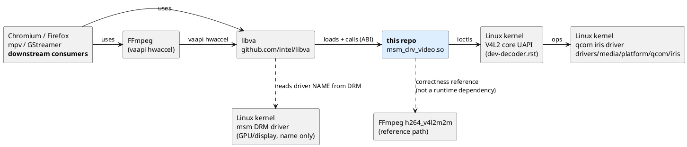

# 05 · Upstream, downstream, and the ecosystem

*"Upstream" and "downstream" mean two different things in open source,
and both matter here. This chapter disentangles them, maps every related
project, and explains where this work could "live" long-term.*

---

## 1. Two meanings of upstream/downstream

| Sense | Meaning | For this repo |
|---|---|---|
| **Dependency** | Upstream = what you build on. Downstream = what builds on you. | Upstream: libva, the kernel (V4L2 + iris), FFmpeg (ground truth). Downstream: every VA-API consumer. |
| **Contribution** | Upstream = the canonical project where code is maintained for everyone. "Getting something upstreamed" = your change is accepted there. | This driver is currently *downstream-only* (local tree). Chapter 6 of the roadmap is about production quality; upstreaming would come after. |

Confusingly, dependency-upstream and contribution-upstream point in the
same direction: you depend on your upstream, and you send changes
*up* to it.

## 2. The dependency map

## 3. Our upstreams — what we consume, and what to watch

### 3.1 libva (VA-API client library + driver ABI)

- Repo: `github.com/intel/libva`. Defines the *API* apps call
  (`va/va.h`) and the *driver ABI* drivers implement (`va/va_backend.h`).
- What we consume: the vtable layout, `__vaDriverInit_<maj>_<min>`
  symbol convention, driver discovery (`va/drm/va_drm_utils.c` — its
  `driver_name_map` has no `msm` entry, so the DRM name passes through
  unchanged), and the `VA_*` struct layouts frozen in `bindings.rs`.
- What breaks us: a new libva adding a vtable member is harmless
  (we initialize every member with a stub); an ABI bump changing the
  init symbol name (e.g. `__vaDriverInit_1_24`) requires renaming our
  export. Watch libva release notes.

### 3.2 Linux kernel — V4L2 UAPI + iris driver

- The **V4L2 stateful decoder UAPI** (`Documentation/userspace-api/
  media/v4l/dev-decoder.rst`) is a stable kernel↔user contract: ioctls,
  formats, events, `VIDIOC_DECODER_CMD` drain semantics. Breakage here
  is rare by kernel policy (UAPI never breaks).
- The **iris driver** (Qualcomm, mainline since Linux 6.15 for SM8550,
  extended to SoCs like X1E80100 in later kernels; development happens
  in `github.com/qualcomm-linux/video-driver` before mainlining) is
  where device-specific behavior lives: supported formats, buffer-count
  limits, event quirks, drain behavior. Changes in iris's *behavior*
  (not the UAPI) can require driver adjustments — that's why the repo
  has fallback chains like the CAPTURE pool size (20 → 16 → 4).
- The **msm DRM driver** matters only for the name libva discovers. If
  libva ever adds a `driver_name_map` entry remapping `msm`, the `.so`
  filename would need to change accordingly.

### 3.3 FFmpeg `h264_v4l2m2m` — the reference upstream

Not a runtime dependency, but the project's *definition of correct*:
byte-for-byte framemd5 parity. If FFmpeg's native path ever behaves
differently after an update, the comparison target moves — re-run the
harness from [chapter 4 §7](04-code-tour.md#7-build-test-and-debug)
before assuming our driver regressed.

## 4. Our downstreams — who consumes this driver, and what they need

| Consumer | How it uses VA-API | What it needs from us |
|---|---|---|
| FFmpeg `-hwaccel vaapi` | full decode pipeline, sync + get/derive image | correctness (works today), EOS drain for full files |
| mpv (`--hwdec=vaapi-copy`) | image copy path | same as FFmpeg + robust image lifecycle |
| GStreamer (`vah264dec`) | surfaces, possibly dmabuf | phase 2–3 features |
| Chromium / Firefox | **zero-copy**: import decoded frames as GPU textures via `vaExportSurfaceHandle` dmabufs | phase 3 (`VIDIOC_EXPBUF` + export + lifetime management) — the browser milestone |

The general rule: **CPU-copy paths are forgiving; zero-copy paths are
not.** Browsers import our exported dmabuf into the GPU as a texture —
strides, modifiers, and buffer lifetimes must be exactly right, or they
render garbage or crash the GPU process. That's why zero-copy is its own
roadmap phase rather than a weekend patch.

## 5. Sibling projects you will meet in the wild

| Project | What it is | Relationship to this work |
|---|---|---|
| **Venus** | Qualcomm's *older* V4L2 decoder driver (pre-Iris SoCs), also stateful M2M | Same UAPI, different hardware; a driver like ours targeting Venus would differ mainly in device node/quirks |
| **Mesa VA-API drivers** (radeonsi, d3d12, …) | Vendor VA drivers living inside Mesa, talking to *GPU* decode blocks via internal Gallium APIs | The "conventional" shape of a VA driver; ours instead leans on a VPU exposed via V4L2 |
| **Stateless V4L2 decoders** (e.g. hantro, cedrus) and the Mesa stateless VA work | Kernel exposes *stateless* API; user space (Mesa) supplies per-frame parsed state and references | The opposite trade-off of stateful: more user-space work, more control. If Iris ever grows a stateless interface, the architecture in chapter 7 changes accordingly |
| **libavcodec `h264_v4l2m2m`** | FFmpeg's direct V4L2 decoder | Our parity reference |
| **virtio-video** | VM pass-through of video decode | Shows the same "translate a standard API onto a device API" pattern in a different direction |

## 6. If/when this work gets "upstreamed"

Realistic long-term homes, in increasing order of invasiveness:

1. **Standalone driver repo** (current shape, cleaned up): publish the
   `.so` as its own project, installed like any VA driver. Works for a
   community; nothing to negotiate with anyone.
2. **A general "VA-API over V4L2 stateful" driver**: generalize this
   code so *any* stateful V4L2 decoder (iris, Venus, others) works —
   device config via `V4L2_VA_DEVICE`/auto-probing. This is the most
   reusable form of the knowledge in this repo.
3. **Mesa integration**: would mean reshaping into Mesa's build/code
   conventions (C/C++, Gallium or its VA state-tracker) — a rewrite,
   essentially. Worth it only if the goal becomes shipping in
   distributions *as part of Mesa*.
4. **Rust kernel-adjacent ecosystem**: the Rust part is unremarkable
   here (user-space cdylib), which is a feature: no kernel-Rust
   dependencies at all.

Whichever path: the hard currency is the same — the framemd5 harness,
the drain semantics, and the export lifetime story from the roadmap.

## 7. References / further reading

- Kernel decoder contract: `Documentation/userspace-api/media/v4l/dev-decoder.rst`
  (also online: <https://www.kernel.org/doc/html/latest/userspace-api/media/v4l/dev-decoder.html>)
- libva sources (driver loading, ABI): <https://github.com/intel/libva>
- Iris mainline merge coverage: <https://www.phoronix.com/news/Linux-6.15-Media-Subsystem>
- Iris upstream patch series: <https://lkml.iu.edu/2411.2/04299.html>
- Qualcomm's driver development tree: <https://github.com/qualcomm-linux/video-driver>
- VA-API API reference (well-commented `va.h`): <https://github.com/intel/libva/blob/master/va/va.h>

---

*Next: [chapter 6 — the roadmap, explained](06-roadmap.md).*
