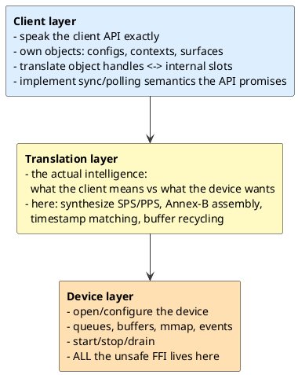
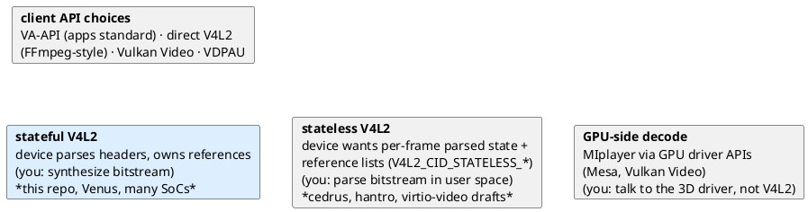

# 07 · Blueprint: writing your own driver

This repo is a worked example of a *category* of software: a
**translation driver** between a client-facing API and a device-facing
API. Once you see the pattern, you can write one for a different device
(another SoC's VPU, a camera ISP, an encoder), a different client API
(Vulkan Video, direct V4L2), or a different OS contract.

This chapter distills the reusable recipe, mapping every step to where
this repo does it.

---

## 1. The transferable architecture

Every driver in this category is three layers with clean seams:



Design rules this repo follows (copy them):

1. **The device layer is the only unsafe place.** `v4l2.rs` owns every
   raw pointer; everything above sees `Vec<u8>` and indices.
2. **One mutex, no cleverness.** Correct and boring beats clever and
   flaky. Driver bugs are miserable to debug; pay with locks.
3. **No background threads.** Progress happens when the client calls
   (sync/pump) or when backpressure forces it. If you add threads, you
   inherit locking semantics libva doesn't expect.
4. **Fail loud, never wedge.** Return `VA_STATUS_ERROR_*` instead of
   blocking forever; timeouts everywhere (`sync` = 10 s, pump waits,
   submission pacing caps).

## 2. The recipe, step by step

### Step 0 — Reconnaissance (no code)

Before writing anything, answer with tools, not guesses:

```sh
v4l2-ctl --list-devices                      # what devices exist?
v4l2-ctl -d /dev/video16 --all               # driver name, caps
v4l2-ctl -d /dev/video16 --list-formats-ext  # OUT: H264? CAP: NV12?
ls /dev/dri/ && cat /sys/kernel/debug/dri/*/name  # DRM driver name ("msm")
```

Also: find a known-good decoder path for your hardware (here:
`ffmpeg -c:v h264_v4l2m2m`). It will be your correctness oracle.

### Step 1 — Skeleton that `vainfo` accepts

The smallest honest driver exports one symbol and reports profiles:

- `__vaDriverInit_<maj>_<min>` (copy the symbol libva expects — see
  `va_backend.h` / `VA_MAJOR_VERSION`),
- fill the **entire vtable** with typed callbacks returning
  `VA_STATUS_ERROR_UNIMPLEMENTED` *first*, then implement real handlers
  for: `Terminate`, `QueryConfigProfiles`, `QueryConfigEntrypoints`,
  `GetConfigAttributes`, `CreateConfig`, `DestroyConfig`,
  `QueryConfigAttributes`, `QueryImageFormats`.

Checklist for "vainfo passes" (this repo's map):
`__vaDriverInit_1_24` + `install_vtable` (`vtable.rs`), profiles list
(`SUPPORTED_PROFILES`), vendor string. Test: `vainfo` prints your
profiles.

**Why this step is its own milestone:** it validates the loading chain
(dlopen, symbol, vtable, ABI version) in isolation from any decoding
logic. When `vainfo` fails here, the bug is *always* in the seam, not
the logic.

### Step 2 — Object management, no hardware

Implement surfaces/contexts/buffers as pure bookkeeping — slot tables
plus ID math (`lib.rs` `DriverState`, `*_index` functions). The API's
object lifecycle (create → use → destroy, from any thread) is its own
bug farm; exercise it with a tool that just opens/destroys before any
decoding exists.

### Step 3 — Device session per context

`vaCreateContext` → open/configure the device; `vaDestroyContext` →
deterministic teardown (`v4l2.rs`: `open_and_setup`, `Drop`). Get
*teardown* right immediately: munmap, REQBUFS(0), close. Resource leaks
here compound invisibly.

### Step 4 — One frame, end to end (the hard middle)

- Client side: `BeginPicture`/`RenderPicture`/`EndPicture` collecting
  buffers (`lib.rs`).
- Translation: whatever your device needs that the client didn't give
  you — for this repo, SPS/PPS synthesis + Annex-B assembly
  (`h264.rs`). For an encoder target it would be the reverse (parse what
  the client should have given you). This layer is where your project's
  real intellectual content lives; budget most design thought here.
- Device side: submit (`submit_frame`), pump (`pump`), match outputs
  back (`fifo` timestamps → `ReadyCapture`).
- Sync: implement `vaSyncSurface` as a poll-until-ready-or-timeout loop.

### Step 5 — The correctness harness, before you think you need it

Adopt the parity workflow *now*, not after the first mysterious
corruption:

```sh
# your driver:
ffmpeg -hwaccel vaapi ... -i sample -f framemd5 mine.md5
# oracle:
ffmpeg -c:v <known-good> ... -i sample -f framemd5 ref.md5
cmp mine.md5 ref.md5
```

Escalate deliberately: 1 frame → 30 frames → whole file. Each rung
isolates a class of bugs (params → pipelining → drain). Pin pure
functions (like header synthesis) with golden-byte unit tests
(`h264.rs` tests) so refactors can't silently change output.

### Step 6 — Output path

CPU-copy first (`create_image`/`get_image`/`derive_image` in `lib.rs`,
`copy_nv12_region`): it is debuggable (you can dump PNGs), and it makes
players work. Zero-copy export is a *later, separate* milestone
(roadmap phase 3) because its failure modes (strides, modifiers,
lifetime) are orthogonal.

### Step 7 — Lifecycle hardening

In rough order of client cruelty: EOS/drain → surface reuse under
threading (requeue!) → seek/flush → resolution change → repeated
open/close. For each: build a *reproducible* failure command first.
The [roadmap chapter](06-roadmap.md#5-how-to-work-on-the-roadmap-as-a-learner)
is exactly this list with hardware-specific detail.

## 3. Porting table: this driver → a different device

If your target is *another V4L2 stateful decoder*, most of this repo
carries over. What changes:

| Concern | Here (Iris) | What to check on yours |
|---|---|---|
| Device node | `/dev/video16` (override: `V4L2_VA_DEVICE`) | `v4l2-ctl --list-devices`; auto-probe via media controller |
| INPUT format | `V4L2_PIX_FMT_H264` | `--list-formats-ext` on OUTPUT |
| OUTPUT format | NV12 | CAPTURE format; maybe multiple planes |
| Buffer counts | OUT 16, CAP 20→16→4 fallback | device `REQBUFS` minima; pipelining depth |
| Header synthesis | H.264 SPS/PPS from VA structs | per codec; HEVC similar, VP9/AV1 differ |
| Timestamp matching | POC-derived µs in FIFO | your correlation scheme |
| Events | `SOURCE_CHANGE`, `EOS` | same UAPI; behavior may differ |
| Drain | `V4L2_DEC_CMD_STOP` | same UAPI; verify with a short file first |
| Quirks | CAPTURE format only valid after first frame (deferred pool) | discover empirically; keep fallback chains |

## 4. Choosing your stack: stateful, stateless, and alternatives

Where your device sits decides the translation layer's difficulty:



Guidance for a first driver project:

- **Stateful V4L2 device + VA-API client** is the sweet spot this repo
  demonstrates: the kernel does parsing/references (hard), you do
  translation (interesting), the client API is documented.
- **Stateless** teaches you vastly more about the codec itself (you must
  parse and track references) and is where upstream desktop effort is
  heading — a great *second* project.
- **Direct V4L2 client** (like `h264_v4l2m2m`) skips the client-API
  layer entirely: a smaller project, but it helps only one consumer.

## 5. Exercises (progressive, on this repo)

1. **Read the seam.** Trace what exactly happens between
   `vaInitialize()` and `vainfo` printing profiles. Draw the sequence
   yourself, then compare with [chapter 2 §3](02-stack.md#3-how-libva-finds-and-loads-this-driver).
2. **Make it fail on purpose.** Rename the `.so` to `foo_drv_video.so`,
   run `vainfo`, read the error. Understand the naming contract by
   breaking it.
3. **Add a counter.** Expose the number of submitted/decoded frames via
   an env-gated stderr line in `end_picture` and `pump`. Re-run the
   30-frame harness and verify the counts.
4. **Byte archeology.** Run with `V4L2_VA_DUMP=/tmp/frame`, then feed
   `frame_00.bin` to `ffmpeg -c:v h264 -i frame_00.bin -f framemd5 -`.
   You are now decoding with the *synthesized* headers — prove they're
   valid independent of the driver.
5. **Port the synthesis.** Extend `h264.rs` tests: change
   `picture_width_in_mbs_minus1` and predict the SPS bytes before
   running. (This is the core skill for adding a codec in roadmap
   phase 5.)
6. **The big one:** pick *any* stateful V4L2 decoder you can access and
   get `vainfo` + a 30-frame parity harness passing with your own
   driver skeleton, following §2. Everything you need is in chapters
   3–4.

## 6. Parting advice

- The harness is the project. Drivers fail in ways code review can't
  see; byte-parity commands are how you *see*.
- Keep the unsafe at the edge and the state behind one lock; boring
  architecture is what survives debugging at 2 a.m.
- Read the kernel docs (`dev-decoder.rst`) and `va.h` comments — this
  whole stack is unusually well documented; the hard parts are the
  interactions, and interactions are exactly what your translation
  driver owns.

*Back to the [documentation index](README.md).*
